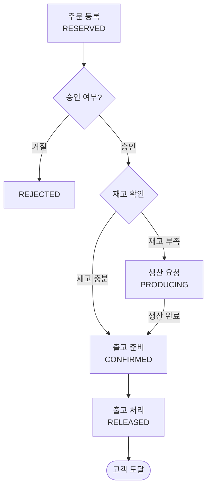

# 반도체 시료 생산주문관리 시스템 (SampleOrderSystem)

가상의 반도체 회사 **S-Semi**의 시료(Sample) 생산 및 주문을 관리하는 **콘솔 기반** 애플리케이션.

## 배경

S-Semi는 다양한 반도체 시료를 생산하여 연구소, 팹리스(Fabless) 업체, 대학 연구실 등에 납품한다.
기존에는 엑셀과 메모장으로 주문을 관리하여 실수가 잦고, 재고와 공정 현황을 한눈에 파악하기
어려웠다. 이를 해결하기 위해 시료 등록부터 주문 접수, 승인/거절, 생산, 출고까지 전체 흐름을
관리하는 시스템을 개발한다.

## 주문 처리 흐름



`PRODUCING`은 생산 완료 후 반드시 `CONFIRMED`를 거쳐야 `RELEASED`(출고)로 갈 수 있다.

| 상태 | 의미 |
|---|---|
| RESERVED | 주문 접수 |
| REJECTED | 주문 거절 (정상 흐름 외, 모니터링 제외) |
| PRODUCING | 승인 완료 및 재고 부족으로 생산 중 |
| CONFIRMED | 승인 완료 및 출고 대기 중 |
| RELEASED | 출고 완료 |

## 주요 기능

| 메뉴 | 설명 |
|---|---|
| 시료 관리 | 시료 등록/조회/검색 (시료 ID, 시료명, 평균 생산시간, 수율) |
| 시료 주문 | 고객 주문 접수 → `RESERVED` 생성 |
| 주문 승인/거절 | 재고 상황에 따라 `CONFIRMED`/`PRODUCING`으로 자동 분기, 또는 `REJECTED` 처리 |
| 모니터링 | 상태별 주문 현황, 시료별 재고 현황(여유/부족/고갈) 확인 |
| 생산 라인 | 단일 생산 라인(FIFO)의 현재 처리 중/대기 중 주문 확인, 실 생산량 계산 |
| 출고 처리 | `CONFIRMED` 주문에 대해 출고 실행 → `RELEASED` |

- 시료 하나의 수율 = 정상 생산 시료 수 / 총 생산 시료 수
- 실 생산량 = `ceil(부족분 / 수율)`이며, 수율로 인한 여분은 재고에 그대로 반영되어 이후 다른
  주문에도 사용된다.

## 기술 스택

- 언어: C++20
- 빌드: Visual Studio 솔루션(`SampleOrderSystem-HSJ-0007.slnx`), MSBuild `.vcxproj`
  (Win32/x64, Debug/Release)
- 애플리케이션 유형: 콘솔 애플리케이션

빌드 명령 (MSBuild, Developer PowerShell 기준):

```
msbuild SampleOrderSystem-HSJ-0007.slnx /p:Configuration=Debug /p:Platform=x64
```

## 프로젝트 문서 구조

| 문서 | 역할 |
|---|---|
| [REQUIREMENT.md](./REQUIREMENT.md) | 요구사항 명세 (무엇을 만들 것인가) |
| [CLAUDE.md](./CLAUDE.md) | Claude Code(AI 에이전트) 작업 가이드 및 원칙 |
| [docs/DESIGN/design.md](./docs/DESIGN/design.md) | 구현 설계 — 자료구조/알고리즘/디렉터리 구조 등 (어떻게 만들 것인가) |
| [docs/TEST/test.md](./docs/TEST/test.md) | AI 작업물 검증(Verify) 절차 |

## 개발 방식

Agentic Engineering을 적용하여 개발한다.

1. 문서 관리 — REQUIREMENT.md/CLAUDE.md/design.md/test.md 체계로 요구사항·설계·검증 절차를 분리 관리
2. Harness 도입 — 개발 → Verify → Human Review 순서를 강제 (자세한 내용은 test.md)
3. Test — Model 계층(상태 전이, 수율 계산, FIFO 큐)부터 우선 테스트
4. Clean Code — 가독성 우선, 함수/클래스 단일 책임, PR 100라인 이내
5. Commit 이력 — 기능 단위 커밋, 커밋 전 사용자 리뷰 필수

